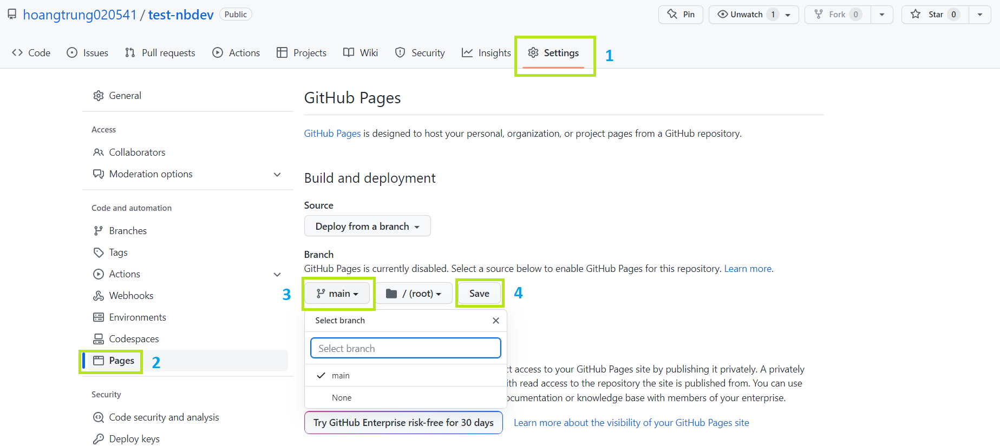
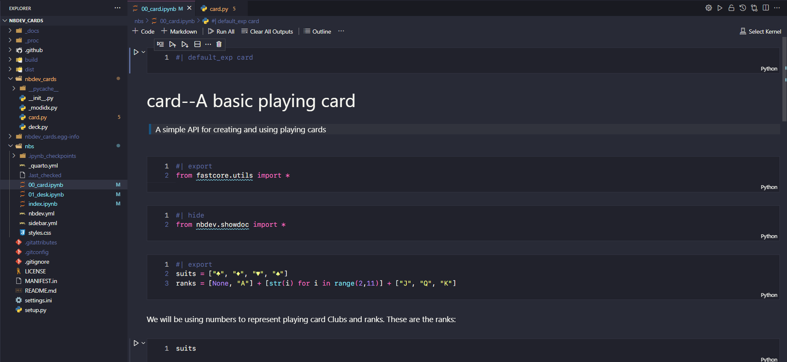
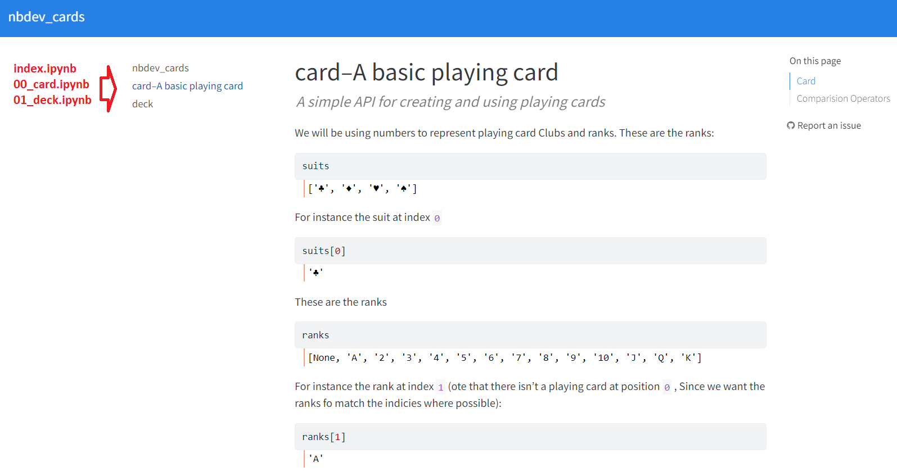
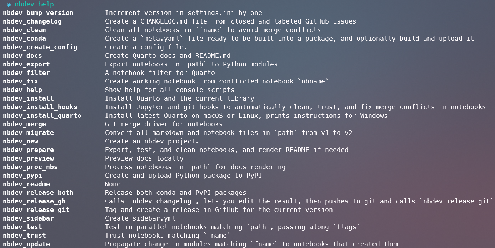

nbdev Tutorial
================

<!-- WARNING: THIS FILE WAS AUTOGENERATED! DO NOT EDIT! -->

Một vài hướng dẫn cơ bản cách sử dụng `nbdev` cho AI Engineer, để biết
thêm chi tiết về cách sử dụng hãy truy cập [nbdev official
tutorial](https://nbdev.fast.ai/) hoặc YouTube video [nbdev tutorial –
zero to published project in 90
minutes](https://www.youtube.com/watch?v=l7zS8Ld4_iA)

## Why nbdev?

Là một AI engineer, bạn chủ yếu làm việc với các file `.ipynb` . Tuy
nhiên, trong quá trình triển khai production, các file `.py` là bắt buộc
để các model AI có thể hoạt động với Web backend. Tuy nhiên, hầu hết
những người mới bắt đầu đều thiếu software skill và khó khăn trong việc
code các file Python. Đó là lý do tại sao [nbdev](https://nbdev.fast.ai)
ra đời và đến giải cứu bạn.

Nbdev là một battery-ready notebook development platform, được xây dựng
trên [Quarto](https://quarto.org) platform. Nó cho phép: - Đồng bộ giữa
file `.ipynb` và file `.py` - Tạo nhanh document sử dụng
[markdown](https://www.markdownguide.org) (\*) trong khi develop -
Publish package của bạn trên PyPI hoặc Conda - [Continuous
Integration](https://www.youtube.com/watch?v=8aV5AxJrHDg&list=PLZMWkkQEwOPmGolqJPsAm_4fcBDDc2to_)
với git và chạy trên git page - Test, code, document ở một nơi

(\*) Markdown thường được sử dụng trong github repo với tên `readme.md`,
để tìm hiểu thêm về Markdown hãy truy cập [Markdown
Guide](https://www.markdownguide.org/).

## How To Use nbdev

### 1. Installation

- Python
- Trình quản lý Python package: Khuyến khích sử dụng `conda` hoặc `pip`
- Jupyter Notebook: `pip install notebook` hoặc `conda install notebook`
- nbdev: `pip install nbdev` hoặc `conda install -c fastai nbdev`
- Quarto: `nbdev_install_quarto`

### 2. Tạo github repository trống và clone về local

- Bạn có thể tạo nhanh một github repo thông qua link này:
  [github.com/new](https://github.com/new).
- Nhớ thêm description cho repo, bởi vì nbdev sẻ sử dụng nó. Không tạo
  tạo các file `README.md`, `.gitignore`, hoặc `license`.
- Clone code về local và di chuyển đến repo đó bằng command
  `cd name_repo` trên terminal.

### 3. Khởi tạo nbdev trên repository

- Để khởi tạo nbdev trên repository, bạn hãy sử dụng command `nbdev_new`
  trên terminal
- Sau khi khởi tạo nbdev, một số file và folder được tạo ra:  
  `.github` Chứa workflow cho CI.  
  `_proc`  
  `nbs` Là viết tắt của “notebook source”, đây là nơi làm việc của các
  file notebook `.ipynb`  
  `test_nbdev` Sau khi xử lý các tệp notebook, các tệp `.py` sẽ được
  export vô lib này (tên folder này dựa trên tên repository)  
  `.gitignore` Chỉ định file/folder không mong muốn khi push lên
  github  
  `LICENSE`  
  `MANIFEST.in`  
  `README.md` File này được đồng bộ từ `nbs/index.ipynb`, nếu muốn edit
  file ‘README.md’ hãy vô file ‘index.ipynb’ edit  
  `setting.ini` Chứa các thông số cấu hình cho project như tên tác giả,
  tên dự án, version …  
  `setting.py`  
  

### 4. Push repository đã được khởi tạo nbdev lên GitHub

- Các command sau để push lên github:  
  `git add .`  
  `git commit -m 'chore: initial commit'`  
  `git push`  
- Sau khi push reposirory nbdev của bạn lên GitHub, điều hướng đến
  `Actions`, nếu bạn sẽ thấy `CI` bị Fail. Điều này là do GitHub mặc
  định giới hạn PAT permission, hãy nhấp vào **settings** trong
  repository
  `Settings > Actions > General > Workflow permissions > Read and write permission > Save`.
  Bây giờ CI của bạn sẽ chạy lại và hoạt động ngay.

### 5. Kích hoạt GitHub Pages

- Bạn cần kích hoạt GitHub Pages cho repository của mình bằng cách nhấp
  vào **settings** trong repository `Setting > Pages > Branch` chọn
  branch bạn muốn và `Save`.
  

- Việc kích hoạt GitHub Pages này sẽ tạo ra một pages docs trông
  beautiful như này [nbdev page
  example](https://hoangtrung020541.github.io/nbdev_cards/).
  

### 6. Các bước cơ bản để build một nbdev repository

- **Install hooks** sử dụng command `nbdev_install_hooks`.  
  Hooks đảm bảo rằng các kiểm tra và các processes cần thiết được chạy
  mỗi khi có thay đổi được thực hiện trên kho repository, như chuyển đổi
  các file notebooks thành file Python và kiểm tra syntax errors, giúp
  giữ code và repository được tổ chức và nhất quán.

- **Edit .ipynb**  
  Truy cập vào folder `/nbs` để tạo và edit các file notebook ở đây, chi
  tiết các viết nbdev notebook sẽ được nêu trong phần
  Directives ở sau.

- **Build library** sử dụng command `nbdev_export`.  
  Sau khi viết xong file notebook, bạn hãy sử dụng command này giúp
  convert từ file Jupyter Notebook `.ipynb` thành file Python `.py` và
  sử dụng làm library trong project, giúp code có thể reusable,
  maintainable và dễ dàng tích hợp vào các project khác. Ngoài ra nbdev
  còn convert file `.ipynb` hiển thị trên GitHub Page (khi push).  
  Note: Bạn cũng có thể sử dụng `import nbdev; nbdev.nbdev_export()` tại
  cuối mỗi file notebook để export thay vì sử dụng command.

> Ví dụ trong hình dưới, đây là file `00_card.ipynb` trong folder `/nbs`
> 

> Và đây là kết quả khi sử dụng command `nbdev_export`, nbdev sẽ convert
> file `/nbs/00_card.ipynb` thành file `/nbdev_cards/card.py` (cụ thể
> tại những cell có `#| export` trên notebook sẽ được convert qua file
> `.py`) 

> Ngoài ra file `00_card.ipynb` cũng sẽ được update lên [GitHub
> Page](https://hoangtrung020541.github.io/nbdev_cards/card.html) khi
> push repository lên github thông qua `CI` của nbdev. Trong đó các số
> thứ tự trước tên file `ipynb` sẽ quyết định thứ tự của chúng trên
> page, file `index.ipynb` sẽ nằm đầu tiên.
> 

- **Install package** sử dụng command `pip install -e '.[dev]'`.  
  Command này được sử dụng trong quá trình develop một Python package để
  cho phép package được cài đặt và sử dụng trong environment trực tiếp
  trong khi source code đang được chỉnh sửa, thường được sử dụng sau khi
  bạn export một file notebook.  
  *Note: Nếu bạn thực hiện các thay đổi đối với code mà không ảnh hưởng
  đến quá trình install (chẳng hạn như thêm các feature mới hoặc fix
  bug), bạn có thể không cần phải chạy lệnh này.*

- **Preview docs** sử dụng command `nbdev_preview`.  
  Sau khi hoàn chỉnh một file notebook, khi run command này terminal sẽ
  hiển thị một browser link ở định dạng HTML chạy trên local (ví dụ như
  `http://localhost:3744/`). Click vào link để xem trước các bản
  notebook như thế nào trước khi được đưa lên GitHub Page.

- **Prepare change** sử dụng command `nbdev_prepare`.  
  Sử dụng trước khi commit hoặc push lên github, để đảm bảo các module
  của bạn được export đúng cách và các bài test được vượt qua. Trong đó
  command `nbdev_prepare`đóng gói các lệnh sau:  
  `nbdev_export`: Build file`.py` module từ Jupyter notebooks  
  `nbdev_test`: Tests các file để kiểm tra bug  
  `nbdev_clean`: Loại bỏ các output thừa trong notebook để tạo ra một
  phiên bản notebook “sạch” hơn để đăng trên Github  
  `nbdev_readme`: Updates file README.md từ file `index.ipynb`.

- **Push lên Github**  
  Lỗi có thể xảy ra vì bạn quên chạy command `nbdev_prepare`. Vì vậy,
  hãy nhớ chạy command này trước khi push lên GitHub, các command để
  push github:  
  `git add .`  
  `git commit -m <message>`  
  `git push`

## Directives

Trong nbdev, các directive (hay còn gọi là “magic comments”) là các câu
lệnh đặc biệt được sử dụng để thực hiện các chức năng nhất định trong
quá trình phát triển và tạo tài liệu cho package. Các directives bắt đầu
bằng `#|` và được đặt ở đầu mỗi cell code trong Jupyter Notebook. Các
directive được sử dụng như tín hiệu cho Quarto trong quá trình tạo docs.
các tín hiệu này cho biết Quarto nên xử lý các ô như thế nào và định
dạng tài liệu như thế nào. \> Tìm hiểu thêm về Quarto tại
[quarto.org](https://quarto.org/)

### 1. Cell Visibility

Các directive sau đây để thực hiện các chức năng cho page, không áp dụng
đối với file `.py` - `#| hide` Để ẩn cell code và output trên page. -
`#| echo: <true|false>` Để ẩn cell code trên page và chỉ hiện output
(false) , để hiện cả cell code và output trên page (true). -
`#| output: <true|false|asis>` Để set hiển thị output, ẩn (false), hiện
(true), hoặc hiển thị kiểu raw markdown (asis) trên page. -
`#| hide_line` Để ẩn 1 dòng code trong cell notebook. -
`#| filter_stream <keyword>` Lọc các dòng chứa từ khóa cụ thể trong kết
quả output của cell. - `#| code-fold: <show|true>` Để thu gọn cell code.

### 2. Generating Source Code

- `#| default_exp <name>` Để tạo ra một Python package `<name>.py` từ
  tệp notebook hiện tại khi export.
- `#| export` Chỉ định một cell trong notebook sẽ được export đến file
  Python `.py`, ngoài ra directive này cũng tạo documentation chi tiết
  tại cell đó trên page.
- `#| exports` tương tự như `#| export` nhưng hiển thị thêm docs thông
  qua `showdoc.show_doc`.
- `#| exporti`Để đánh dấu một hàm hay một đoạn code trong tệp notebook
  để được xuất ra như một phần của một module con riêng biệt, ví dụ sau:
  

### 3. Cell Execution

- `#| exec_doc`: Tạo docs trên cell code.
- `#| eval: <true|false>` Khi để false, cell code sẽ được ignore trong
  quá trình test thông qua command `nbdev_test`.

## Command

Bạn có thể chạy command `nbdev_help` trên terminal để xem danh sách đầy
đủ các command có sẵn:

