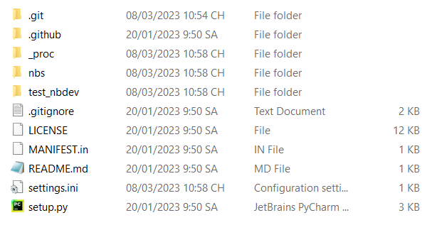

nbdev Tutorial
================

<!-- WARNING: THIS FILE WAS AUTOGENERATED! DO NOT EDIT! -->

## Why nbdev?

Là một AI engineer, bạn chủ yếu làm việc với các file `.ipynb` . Tuy
nhiên, trong quá trình triển khai production, các file `.py` là bắt buộc
để các model AI có thể hoạt động với Web backend. Tuy nhiên, hầu hết
những người mới bắt đầu đều thiếu software skill và khó khăn trong việc
code các file Python. Đó là lý do tại sao [nbdev](https://nbdev.fast.ai)
ra đời và đến giải cứu bạn.

Nbdev là một battery-ready notebook development platform, được xây dựng
trên [Quarto](https://quarto.org) platform. Nó cho phép: - Đồng bộ giữa
file `.ipynb` và file `.py` - Tạo nhanh document sử dụng
[markdown](https://www.markdownguide.org) (\*) trong khi develop -
Publish package của bạn trên PyPI hoặc Conda - [Continuous
Integration](https://www.youtube.com/watch?v=8aV5AxJrHDg&list=PLZMWkkQEwOPmGolqJPsAm_4fcBDDc2to_)
với git và chạy trên git page - Test, code, document ở một nơi

(\*) Markdown thường được sử dụng trong github repo với tên `readme.md`.
để tìm hiểu thêm về Markdown hãy truy cập [Markdown
Guide](https://www.markdownguide.org/).

## How To Use nbdev

### 1. Installation

- Python
- Trình quản lý Python package: Khuyến khích sử dụng `conda` hoặc `pip`
- Jupyter Notebook: `pip install notebook`’ hoặc
  `conda install notebook`
- nbdev: `pip install nbdev` hoặc `conda install -c fastai nbdev`
- Quarto: `nbdev_install_quarto`

### 2. Tạo github repository trống và clone về local

- Bạn có thể tạo nhanh một github repo thông qua link này:
  [github.com/new](https://github.com/new).
- Nhớ thêm description cho repo, bởi vì nbdev sẻ sử dụng nó. Không tạo
  README file, .gitignore, hoặc license file.
- Clone code về local và di chuyển đến repo đó bằng lệnh `cd name_repo`
  trên terminal.

### 3. Khởi tạo nbdev trên repository

- Khởi tạo nbdev trên repository bằng cách sử dụng command `nbdev_new`
  trên terminal
- Sau khi khởi tạo nbdev, một số file và folder được tạo ra: \>
  `.github`: Chứa workflow cho CI.  
  \> `_proc`  
  \> `nbs`: Là viết tắt của “notebook source”, trong đây là nơi làm việc
  của các file notebook `.ipynb`  
  \> `test_nbdev`: Sau khi xử lý các tệp notebook, các tệp `.py` sẽ được
  export vô lib này (folder này của tôi có thễ khác với bạn, nó dựa trên
  tên repository)  
  \> `.gitignore`: Chỉ định file/folder không mong muốn khi push lên
  github  
  \> `LICENSE`  
  \> `MANIFEST.in`  
  \> `README.md`: File này được đồng bộ từ `nbs/index.ipynb`, nếu muốn
  edit file ‘README.md’ hãy vô file ‘index.ipynb’ edit  
  \> `setting.ini`: Chứa các thông số cấu hình cho project như tên tác
  giả, tên dự án, version …  
  \> `setting.py`  
  \> 

### 4. Push repository đã được khởi tạo nbdev lên GitHub

- Các command sau để push lên github:  
       `git add .`  
       `git commit -m 'chore: initial commit'`  
       `git push`  
- Sau khi push reposirory nbdev của bạn lên GitHub, điều hướng đến
  `Actions`, nếu bạn sẽ thấy `CI` bị Fail. Điều này là do GitHub mặc
  định giới hạn PAT permission, hãy nhấp vào **settings** trong
  repository
  `Settings > Actions > General > Workflow permissions > Read and write permission > Save`.
  Bây giờ CI của bạn sẽ chạy lại và hoạt động ngay.

### 5. Kích hoạt GitHub Pages

- Bạn cần enable GitHub Pages cho repository của mình bằng cách nhấp vào
  **settings** trong repository `Setting > Pages > Branch` chọn branch
  bạn muốn và `Save`.
  

- Việc enable GitHub Pages này sẽ tạo ra một pages docs beautiful như
  này [nbdev page
  example](https://hoangtrung020541.github.io/nbdev_cards/).
  

### 6. Các bước cơ bản để build một nbdev repository

- **Install hooks** sử dụng command `nbdev_install_hooks`.  
  Hooks đảm bảo rằng các kiểm tra và các processes cần thiết được chạy
  mỗi khi có thay đổi được thực hiện trên kho repository, như chuyển đổi
  các file notebooks thành file Python và kiểm tra syntax errors, giúp
  giữ code và repository được tổ chức và nhất quán.

- **Edit .ipynb**  
  Truy cập vào folder `/nbs` để tạo và edit các file notebook ở đây, chi
  tiết các viết nbdev notebook sẽ được nêu trong phần
  Directives ở sau.

- **Build library** sử dụng command `nbdev_export`.  
  Command này giúp convert từ file Jupyter Notebook `.ipynb` thành file
  Python `.py` và sử dụng làm library trong project, giúp code có thể
  reusable, maintainable và dễ dàng tích hợp vào các project khác. Ngoài
  ra nbdev còn convert file `.ipynb` hiển thị trên GitHub Page.  
  Note: Bạn cũng có thể sử dụng `import nbdev; nbdev.nbdev_export()` tại
  cuối mỗi file notebook để export thay vì sử dụng command.

> Ví dụ trong hình dưới, đây là file `00_card.ipynb` trong folder `/nbs`
> 

> Và đây là kết quả khi sử dụng command `nbdev_export`, nbdev sẽ convert
> file `/nbs/00_card.ipynb` thành file `/nbdev_cards/card.py` (cụ thể
> tại những cell có `#| export` trên notebook sẽ được convert qua file
> `.py`)
> 

> Ngoài ra file `00_card.ipynb` cũng sẽ được update lên [GitHub
> Page](https://hoangtrung020541.github.io/nbdev_cards/card.html) khi
> push repository lên github thông qua `CI` của nbdev. Trong đó các số
> thứ tự trước tên file `ipynb` sẽ quyết định thứ tự của chúng trên
> page, file `index.ipynb` sẽ nằm đầu tiên.
> 

- **Install package** sử dụng command `pip install -e '.[dev]'`.  
  Command này được sử dụng trong quá trình develop một Python package để
  cho phép package được cài đặt và sử dụng trong environment trực tiếp
  trong khi source code đang được chỉnh sửa, thường được sử dụng sau khi
  bạn export một file notebook.  
  *Note: Nếu bạn thực hiện các thay đổi đối với code mà không ảnh hưởng
  đến quá trình install (chẳng hạn như thêm các feature mới hoặc fix
  bug), bạn có thể không cần phải chạy lệnh này.*

- **Preview docs** sử dụng command `nbdev_preview`.  
  Sau khi hoàn chỉnh một file notebook, khi run command này terminal sẽ
  hiển thị một browser link ở định dạng HTML chạy trên local (ví dụ như
  `http://localhost:3744/`). Click vào link để xem trước các notebook
  trông chúng sẽ như thế nào khi được đưa lên GitHub Page.

- **Prepare change** sử dụng command `nbdev_prepare`.  
  Sử dụng trước khi commit hoặc push lên github, để đảm bảo các module
  của bạn được export đúng cách và các bài test được vượt qua. Trong đó
  command `nbdev_prepare`đóng gói các lệnh sau:  
       `nbdev_export`: Build file`.py` module từ Jupyter notebooks  
       `nbdev_test`: Tests các notebooks  
       `nbdev_clean`: Loại bỏ các output thừa trong notebook để tạo ra
  một phiên bản notebook “sạch” hơn để đăng trên Github  
       `nbdev_readme`: Updates README.md từ file `index.ipynb`.

- **Push lên Github**  
  Lỗi có thể xảy ra vì bạn quên chạy command `nbdev_prepare`. Vì vậy,
  hãy nhớ chạy command này trước khi push lên GitHub, các command để
  push github:  
       `git add .`  
       `git commit -m <message>`  
       `git push`

## Directives
